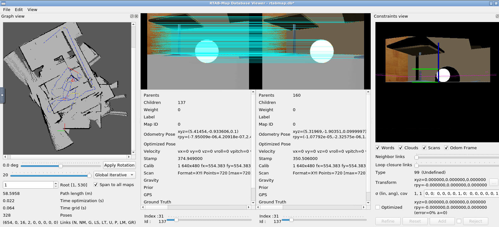

# Map_My_World_RTABMAP
## How to use

In order to run this package follow this steps:
* Make directory for catkin workspace:
```sh
mkdir -p catkin_ws/src
```
* Go to the src directory and init catkin workspace:
```sh
cd catkin_ws/src
catkin_init_workspace
```
* Go to `catkin_ws` directory and pull this repository:
```sh
git init
git remote add origin link_to_this_repo
git pull
git checkout master
```
* Make catkin:
```sh
cd catkin_ws
catkin_make
source devel/setup.bash

```
* Run ROS:

roslaunch my_robot world.launch
```
* In another terminal run rtab-map:
```sh
cd catkin_ws
source devel/setup.bash
roslaunch my_robot mapping.launch
```
* If you want to use Teleop in third terminal write:
```sh
cd catkin_ws
source devel/setup.bash
rosrun teleop_twist_keyboard teleop_twist_keyboard.py
```
* Final map (database) is stored in default location:
```sh
~/.ros/rtabmap.db
```
* For viewing rtabmap.db:
```sh
rtabmap-databaseViewer ~/.ros/rtabmap.db
```
* RTABMAP_Viwer:
```sh

```

